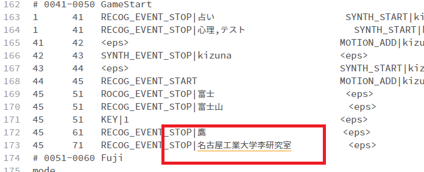
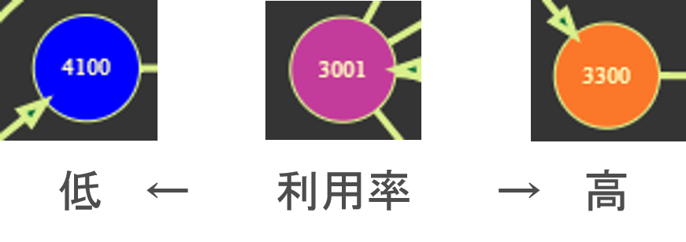

# HELEN - Dialogue Interaction Editor for MMDAgent -

## HELEN とは

HELEN は、MMDAgentの対話シナリオファイル（fstファイル）を編集するための Atom エディタ用拡張パッケージです．

[MMDAgent公式サイト](http://www.mmdagent.jp/)  
[fstファイルとは？](https://qiita.com/m-masaki72/items/8695e7d13607007257c5)  
[Atom公式サイト](https://atom.io/docs)  

HELENでは主に以下の3つの機能を利用することができます．  
- fstファイル編集の補助（対話フローのグラフ表示、認識辞書の自動チェック等）
- MMDAgent のリアルタイムデバッグ（状態遷移をリアルタイム可視化、任意メッセージの送信）
- 動作ログによるフィードバック（MMDAgent の動作ログ → 解析 → 対話シナリオにフィードバック表示）

## 準備

### 動作環境

HELENを利用するために必要な環境は以下の通りです。
- [Atom](https://atom.io/)・・・Version1.37.0以降  
- Windows10以降・・・リアルタイムデバッグ時に必要  
- マイク・・・MMDAgentの利用に必要です  

※リアルタイムデバッグは拡張された専用のMMDAgent（同梱）を使うため、現在は Windows10 のみサポートしています。  
※Windows以外の環境でもAtomが動作する環境であればリアルタイムデバッグ以外の機能は利用可能です．

### インストール手順
1. HELENをダウンロードして解凍します
2. 解凍してできたディレクトリをAtomのpackagesディレクトリ以下に移します．デフォルトはC:\User\\***\\.atom\packages以下です
3. Atomを開きます
4. AtomのPackages→Settings View→Openで設定を開きます
5. Packages→Community PackagesでHELENが表示されることを確認します
6. fstファイルをAtomで開いて準備完了です

<!-- ## Demo -->

## 機能１：fstファイル編集の補助

Atomでfstファイルを開いたとき、以下の機能が利用できます．

- **Draw Graph**: `Ctrl + Alt + shift + g`

最初にグラフ描画タブを開きます．  `MAKE_GRAPH`ボタンを押すことで描画を更新します．「BIG」「SMALL」ボタンでグラフの拡大・縮小ができます．  
  

- **Insert TAB**: `Ctrl + Alt + shift + t`

FSTを編集し終わったらこのコマンドを入力します．自動でFSTが清書されます．  

- **checkDictionary**: `*Ctrl + Alt + shift + d*`

新しく認識する単語を追加したら，このコマンドを実行しましょう．内蔵辞書と比較して未知語を強調表示します．  
強調された単語は[単語辞書に追加](https://mmdagent.wordpress.com/2013/01/18/adding-recognition-words/)するようにしましょう．  

## 機能２：MMDAgent のリアルタイムデバッグ 
---
この機能を利用するためには，以下の動作が必要になります．

### リアルタイムデバッグの準備
1. MMDAgentのコンテンツを作成します．
2. 手順1で作成したコンテンツのディレクトリ内にあるmdfファイルをドラッグします
3. 手順2でドラッグしたmdfファイルを，ダウンロードしたディレクトリ内にある`tools/mmdagent_exe/MMDAgent.exe`にドロップします
4. MMDAgentが起動します
5. 手順1～4までの動作を行ったときと同じpcでAtomを起動します
6. Atom上で作成したコンテンツのfstファイルを開きます
7.  (*Ctrl + Alt + shift + g* ) を入力してグラフ描画タブを開くと準備完了です

### 注意事項
- MMDAgentのコンテンツ作成については[こちら](https://mmdagent.lee-lab.org/?p=460&lang=ja)．[公式サイト](http://www.mmdagent.jp/)からサンプルコンテンツをダウンロードすることも可能です．
- 現在この機能は`Windowsでのみ利用可能`です．
- 手順3で使用するファイルは，MMDAgent公式サイトで公開されている`MMDAgent.exe`ファイルではなく，HELENに同梱されている専用の
`MMDAgent.exe`ファイルが必要です．
- 一定時間起動し続けると不具合が発生することがあります．その際はエディタとMMDAgentをリロード(*shift + r* )してください．

### 状態遷移のリアルタイム可視化

MMDAgentを起動したら，最初に下記の `text Following` のチェックマークをONにすることでフォローモードを起動できます．  
（上手く機能しない場合はもう一度MAKE_GRAPHボタンをクリックしてグラフを更新してください．）  
起動中のMMDAgentの対話シナリオの現在状態番号が随時読み取られ、対応するエディタ上のfstの状態が強調表示されます。
   

現在状態はグラフ上でオレンジ色で表示されます。現在状態はMMDAgentの動作をリアルタイムに反映して移動していきます（下図の赤枠）。
チェックマークをOFFにすると動作を停止します。
  

### 任意メッセージの送信

以下の赤い四角で囲まれた部分にMMDAgentのコマンドを入力して右の「SEND_MESSAGE」をクリックすることで、起動中のMMDAgentに対して任意メッセージの送信が行えます。

## 機能３：動作ログによるフィードバック

HELENでは，MMDAgentの動作ログから抽出した状態滞在時間等の情報を重ねて表示することができます。
これにより、実際の利用状況をフィードバックしながらFSTを編集することができます。

本機能は下記の学会で発表する予定の機能です：

> 森 雅希、李 晃伸．「[音声対話コンテンツ循環環境を実現するための対話シナリオのプロファイル自動収集およびフィードバック](https://confit.atlas.jp/guide/event/jsai2019/subject/3L4-OS-22b-01/tables?cryptoId=)」
> 

動作ログは MMDAgent の標準出力を保存する方法のほか、[Pocket MMDAgent](https://mmdagent.lee-lab.org/) を用いてサーバ経由で取得することも可能です。
ログの作成方法やサーバの仕様など詳細は[こちら](https://mmdagent.lee-lab.org/?p=576&lang=ja)をご覧ください．

### 準備
1. MMDAgentのコンテンツを作成します．  
2. [Pocket MMDAgent](https://mmdagent.lee-lab.org/?p=576&lang=ja)の機能を用いる等して、MMDAgentの動作ログファイルを作成します
3. HELENを解凍してできたディレクトリ内にある`tools/log_server/make_profile.py`を手順2で作成された動作ログファイルがあるディレクトリと同じ場所にコピーします
4. 手順3でコピーした先のディレクトリに移動し，make_profile.pyを実行します
5. 生成されるプロファイル`「MMDAgent.profile」`を作成したコンテンツのfstファイルがある場所と同じディレクトリに移します
6. `MMDAgent.profile`の「MMDAgent」の部分を「\*\*\*.fst」の\*\*\*と同じ名前にします
7. 準備完了です

### 注意事項
- pythonのバージョンは3.7.3で確認しています
- ログファイルはPocket MMDAgentの`MMDAgent.exe`でのみ作成されます．HELENに同梱されている`MMDAgent.exe`ではログファイルの生成・アップロード機能
は現在使用できません．

### 機能一覧
手順1～7までの処理の後，HELENのビューアを更新すると以下のような強調表示が可能となります
  
また，グラフ上の各状態をクリックするとその状態での利用状況を表示させることができます  
認識単語はその状態で認識された単語が表示されます  

## プロファイル表示の凡例

## Licence
MIT

## Author
[Akinobu Lee](https://www.slp.nitech.ac.jp/)，[Masaki Mori](https://github.com/m-masaki72)，[Yuuki Yabusaki](https://www.slp.nitech.ac.jp/~yabusan16/) at Nagoya Institie of Technology, Japan.