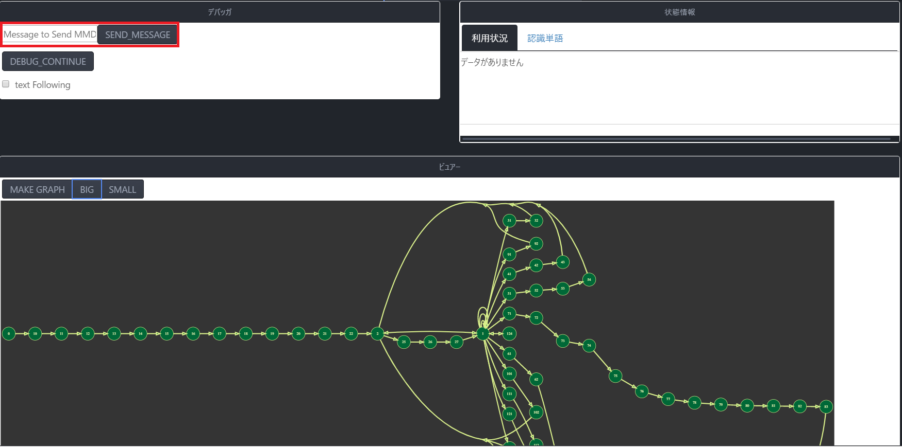
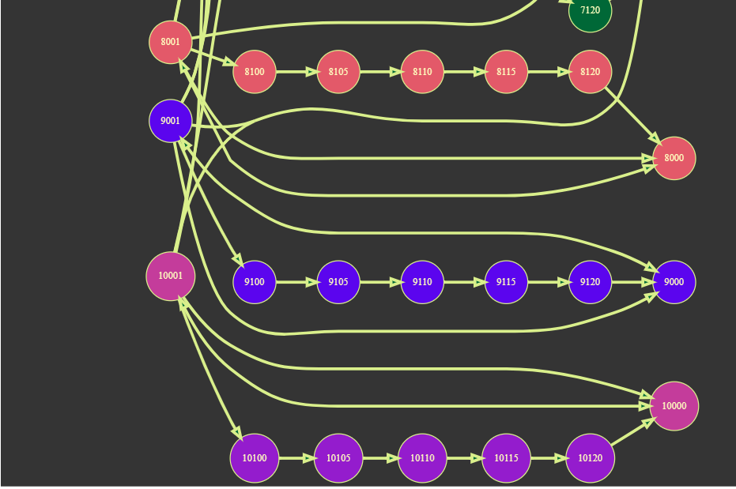

# HELEN-Dialogue-Interaction-Editor-for-MMDAgent-
HELENとはMMDAgentのfstファイル編集のためのAtomエディタ用拡張パッケージです．音声対話構築のための統合エディタを目指しています．  
[MMDAgent公式サイト](http://www.mmdagent.jp/)  
[fstファイルとは？](https://qiita.com/m-masaki72/items/8695e7d13607007257c5)  
[Atom公式サイト](https://atom.io/docs)  

## 主な特徴
HELENでは主に以下の3つの機能を利用することができます．  
- fstファイル編集の補助機能  
- MMDAgentのリアルタイムデバッグ  
- 動作ログによるフィードバック  

## 準備
HELENを利用するために必要な環境
- [Atom](https://atom.io/)・・・Version1.37.0以降  
- Windows10以降・・・リアルタイムデバッグ時に必要  
- マイク・・・MMDAgentの利用に必要です  

※Atomが動作する環境であればリアルタイムデバッグ以外の機能を利用することが可能です．

### インストール手順
1. HELENをダウンロードして解凍します
2. 解凍してできたディレクトリをAtomのpackagesディレクトリ以下に移します．デフォルトはC:\User\\***\\.atom\packages以下です
3. Atomを開きます
4. AtomのPackages→Settings View→Openで設定を開きます
5. Packages→Community PackagesでHELENが表示されることを確認します
6. fstファイルをAtomで開いて準備完了です

<!-- ## Demo -->

## エディタ編集時の補助機能
---
以下に説明する機能は，Atomでfstファイルを開いた状態にすることで利用できます．

### 機能一覧
- Draw Graph (*Ctrl + Alt + shift + g* )  
最初にグラフ描画タブを開きます．  `MAKE_GRAPH`ボタンを押すことで描画を更新します．「BIG」「SMALL」ボタンでグラフの拡大・縮小ができます．  
  

- Insert TAB(*Ctrl + Alt + shift + t* )  
FSTを編集し終わったらこのコマンドを入力します．自動でFSTが清書されます．  

- checkDictionary(*Ctrl + Alt + shift + d* )  
新しく認識する単語を追加したら，このコマンドを実行しましょう．内蔵辞書と比較して未知語を強調表示します．  
強調された単語は[単語辞書に追加](https://mmdagent.wordpress.com/2013/01/18/adding-recognition-words/)するようにしましょう．  

## リアルタイムデバッグ表示  
---
この機能を利用するためには，以下の動作が必要になります．

### リアルタイムデバッグの準備
1. MMDAgentのコンテンツを作成します．
2. 手順1で作成したコンテンツのディレクトリ内にあるmdfファイルをドラッグします
3. 手順2でドラッグしたmdfファイルを，ダウンロードしたディレクトリ内にある`tools/mmdagent_exe/MMDAgent.exe`にドロップします
4. MMDAgentが起動します
5. 手順1～4までの動作を行ったときと同じpcでAtomを起動します
6. Atom上で作成したコンテンツのfstファイルを開きます
7.  (*Ctrl + Alt + shift + g* ) を入力してグラフ描画タブを開くと準備完了です

### 注意事項
- MMDAgentのコンテンツ作成については[こちら](https://mmdagent.lee-lab.org/?p=460&lang=ja)．[公式サイト](http://www.mmdagent.jp/)からサンプルコンテンツをダウンロードすることも可能です．
- 現在この機能は`Windowsでのみ利用可能`です．
- 手順3で使用するファイルは，MMDAgent公式サイトで公開されている`MMDAgent.exe`ファイルではなく，HELENに同梱されている専用の
`MMDAgent.exe`ファイルが必要です．
- 一定時間起動し続けると不具合が発生することがあります．その際はエディタとMMDAgentをリロード(*shift + r* )してください．

### 機能一覧
- Follow Line when MMDAgent is working  
MMDAgentを起動したら，最初にチェックマークをONにすることでフォローモードを起動しましょう．  
上手く機能しない場合はもう一度MAKE_GRAPHボタンをクリックしてグラフを更新してください．  
起動中のMMDAgentに対してエディタ上で現在状態を強調表示するようになります．  
   
以下の赤い四角で囲まれた箇所のように，現在状態がオレンジで表示されます
  

- Send Command Message to MMDAgent  
以下の赤い四角で囲まれた部分にMMDAgentのコマンドを入力してみましょう．  
入力ができたら右の「SEND_MESSAGE」をクリックしてください．起動中のMMDAgentに対してコマンドが送信されます．  

## 動作ログによるフィードバック
---
HELENでは，MMDAgentの動作ログを用いることでより効率的なFST編集を行うことが可能です．  
ログ収集にはPocket MMDAgentの機能を使用することで収集できます．  
ログの作成方法やサーバの仕様など詳細は[こちら](https://mmdagent.lee-lab.org/?p=576&lang=ja)をご覧ください．

### 準備
1. MMDAgentのコンテンツを作成します．  
2. [Pocket MMDAgent](https://mmdagent.lee-lab.org/?p=576&lang=ja)の機能を使用してMMDAgentのログファイルを作成します
3. HELENを解凍してできたディレクトリ内にある`tools/log_server/make_profile.py`を手順2で作成されたログファイルがあるディレクトリと同じ場所にコピーします
4. 手順3でコピーした先のディレクトリに移動し，make_profile.pyを実行します
5. 生成されるプロファイル`「MMDAgent.profile」`を作成したコンテンツのfstファイルがある場所と同じディレクトリに移します
6. `MMDAgent.profile`の「MMDAgent」の部分を「\*\*\*.fst」の\*\*\*と同じ名前にします
7. 準備完了です

### 注意事項
- pythonのバージョンは3.7.3で確認しています
- ログファイルはPocket MMDAgentの`MMDAgent.exe`でのみ作成されます．HELENに同梱されている`MMDAgent.exe`ではログファイルの生成・アップロード機能
は現在使用できません．

### 機能一覧
手順1～7までの処理の後，HELENのビューアを更新すると以下のような強調表示が可能となります
  
また，グラフ上の各状態をクリックするとその状態での利用状況を表示させることができます  
認識単語はその状態で認識された単語が表示されます  

## プロファイル表示の凡例

## Licence
MIT

## Author
[Akinobu Lee](https://www.slp.nitech.ac.jp/)，[Masaki Mori(Nagoya Institie of Technology)](https://github.com/m-masaki72)，[Yuuki Yabusaki](https://www.slp.nitech.ac.jp/~yabusan16/)